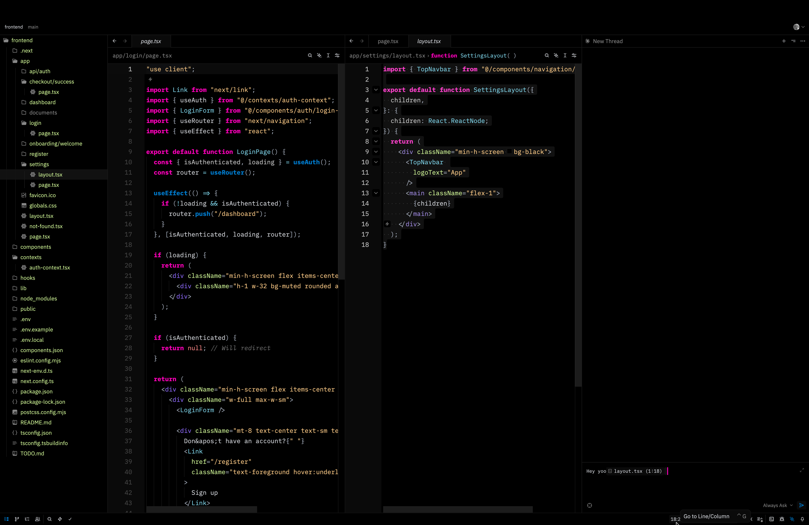

# sl4y Theme for Zed

A vomit-like high contrast theme for the Zed editor.

## Screenshot



## Installation

### Install from Zed Extensions

1. Open Zed
2. Press `cmd-shift-p` (macOS) or `ctrl-shift-p` (Linux/Windows) to open the command palette
3. Type "Extensions" and select "zed: extensions"
4. Search for "sl4y" in the extensions marketplace
5. Click Install

### Manual Installation

1. Clone this repository:
   ```bash
   git clone https://github.com/berkantay/zed-theme-sl4y.git
   ```

2. Open Zed and go to Extensions
3. Click on "Install Dev Extension" and select the cloned directory

## Activation

After installation:
1. Open Zed settings (`cmd-,` on macOS or `ctrl-,` on Linux/Windows)
2. Click on "Select Theme" or search for "theme" in settings
3. Choose "Sl4y Theme" from the list
